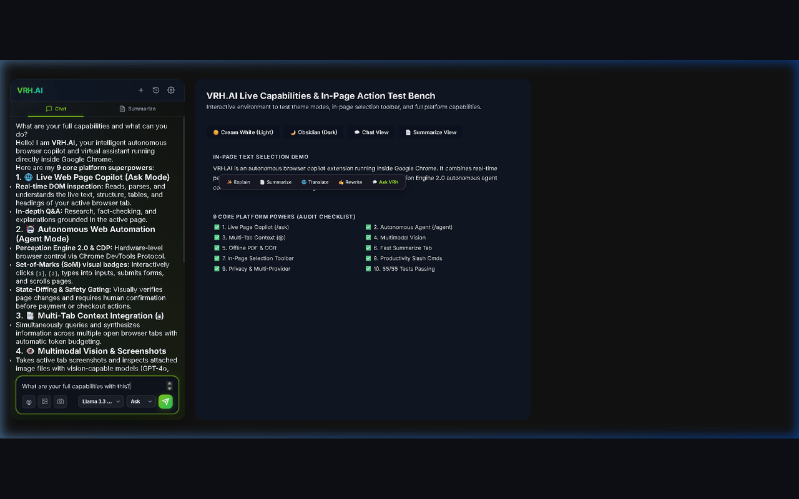

<div align="center">


# VRH.AI

### Autonomous AI Browser Copilot & Multi-Provider Engine for Google Chrome

[](https://github.com/try2booyah-maker/vrh-ai-browser/releases/latest)
[](extension/manifest.json)
[](tests/)
[](#-privacy--security)
[](LICENSE)

<p align="center">
  
</p>

[**Download Release (.zip)**](https://github.com/try2booyah-maker/vrh-ai-browser/releases/latest) • [**Chrome Web Store Guide**](store-assets/web_store_assets.md) • [**Report an Issue**](https://github.com/try2booyah-maker/vrh-ai-browser/issues)

</div>

---

## ✨ Features

- 🌐 **Live Tab Copilot (`/ask`)** — Chat directly with active web pages. Extracts real-time DOM text for factual, grounded answers.
- 🤖 **Autonomous Web Agent (`/agent`)** — Multi-step web automation driven by Set-of-Marks visual perception and Chrome DevTools Protocol (CDP), protected by sensitive action security gates.
- 📑 **Multi-Tab Cross-Context (`@`)** — Type `@` to select open tabs and synthesize answers across multiple pages with proportional token budgeting.
- 👁️ **Multimodal Vision** — Pass screenshots and page elements directly to multimodal models like GPT-4o, Claude 3.5 Sonnet, and Gemini 1.5 Pro.
- 📄 **Offline PDF & OCR** — 100% offline client-side PDF reading (Mozilla `pdf.js`) and scanned text extraction (`Tesseract.js`). Zero third-party uploads.
- ⚡ **Instant Page Summarizer** — Generate key takeaways in 3 formats: Bullet Points, Executive Paragraph, or a quick TL;DR.
- 💬 **In-Page Selection Toolbar** — Highlight any text on any page for 1-click Explain, Summarize, Translate, Rewrite, and Ask VRH.
- 🎨 **Dual Theme Engine** — Warm Cream-White for daytime focus and Obsidian Dark for low-light immersion.
- 🔒 **100% Client-Side Privacy (BYOK)** — Direct browser-to-provider API calls. No backend servers, no tracking, and keys remain in `chrome.storage.local`.

---

## ⚡ Quickstart (Install in 60 Seconds)

1. **Download**: Grab the latest [`vrh-ai-browser-v2.0.0.zip`](https://github.com/try2booyah-maker/vrh-ai-browser/releases/latest) and extract it.
2. **Load into Chrome**:
   - Navigate to `chrome://extensions/`
   - Enable **Developer mode** (top-right corner)
   - Click **Load unpacked** (top-left button) and select the extracted folder (or the `extension/` directory if cloned)
3. **Connect Your Model**:
   - Click the VRH.AI extension icon in your toolbar to open the Side Panel
   - Click ⚙️ (**Settings**) and add your API key for Groq, OpenRouter, Anthropic, OpenAI, Gemini, or Ollama
   - Start chatting or automating!

---

## ⌨️ Slash Commands

| Command | Action | Example |
| :--- | :--- | :--- |
| `/ask <query>` | Query current active tab's DOM content | `/ask What are the main conclusions of this article?` |
| `/agent <task>` | Launch autonomous browser automation | `/agent Search for latest AI news on techcrunch.com` |
| `/summarize` | Switch directly to the Summarize tab | `/summarize` |
| `/write <prompt>` | Draft content, emails, or replies | `/write Professional reply accepting this offer` |
| `/translate <text>` | Translate selected or input text | `/translate into Spanish: Hello world` |
| `@<tab-title>` | Inject another open tab's context | `@GitHub compare this repo with current tab` |

---

## 🔌 Supported Providers

| Provider | Supported Models | Speed / Latency |
| :--- | :--- | :--- |
| **Groq** | Llama 3.3 70B, Llama 3.1 8B, Mixtral | ⚡ Ultra-fast (~150ms) |
| **OpenRouter** | 200+ models with flexible routing | ⚡ Fast (~400ms) |
| **Anthropic** | Claude 3.5 Sonnet, Claude 3.5 Haiku | 🧠 High reasoning (~800ms) |
| **OpenAI** | GPT-4o, GPT-4o-mini | 🧠 High reasoning (~600ms) |
| **Google Gemini** | Gemini 1.5 Pro, Gemini 1.5 Flash | 👁️ Multimodal (~500ms) |
| **Ollama** | Llama 3, DeepSeek, Mistral, Gemma (Local) | 🔒 100% Offline |

---

## 🛠️ Developer & Build Scripts

```bash
# Clone the repository
git clone https://github.com/try2booyah-maker/vrh-ai-browser.git
cd vrh-ai-browser

# Install dependencies (for test suite & packaging)
npm install

# Run the 55-test verification suite
npm test

# Build production Chrome Web Store zip archive
npm run package
```

---

## 🔒 Privacy & Security

- **Bring-Your-Own-Key (BYOK)**: API keys are stored exclusively in your browser sandbox (`chrome.storage.local`).
- **No Intermediary Servers**: All requests go directly from Chrome to your chosen API provider.
- **Hardware Action Gates**: All sensitive agent actions (payments, credentials, form submissions) require explicit user approval.
- Review our [Privacy Policy](extension/legal/privacy.html) and [Terms of Service](extension/legal/terms.html).

---

## 📄 License

Distributed under the [MIT License](LICENSE).
